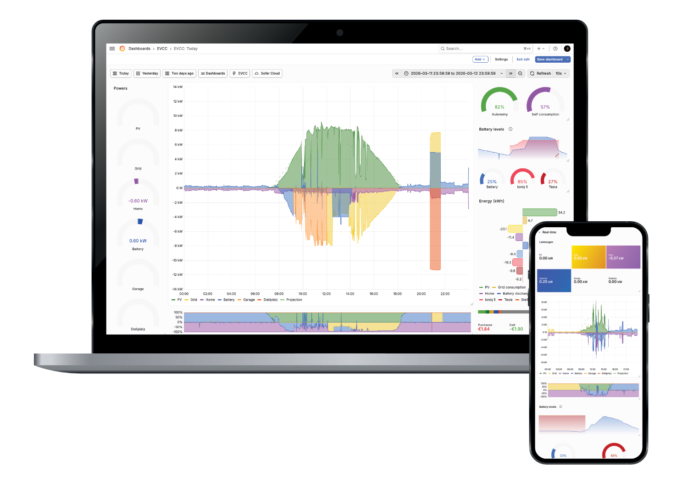

# Grafana Dashboard für EVCC

> [!NOTE]
> Die ältereren Dashboards für Influx DB 1.8 wurden in den Unterorder [`influx`](./influx/) verschoben.

Ein Satz von EVCC Dashboards für Grafana mit Victoria Metrics:
- Realtime Dashboard for Desktop und Mobile.
- Detailierte Realtime-Statistiken
- Monatliche und jährliche Statistiken.
- Erweiterte All-Time Statistiken mit finanziellen Berechnungen zur Amortisation der PV Anlage sowie grobe Schätzungen der Einsparungen durch ein Elektrofahrzeug

Bitte beachtet auch inbesondere den nächsten Abschnitt, der die Voraussetzungen listet sehr genau, bevor ihr anfangt.

## Grundvoraussetzungen

Folgende Voraussetzungen müssen erfüllt sein, damit diese Dashboards bei Euch laufen:

- EVCC: https://evcc.io/ (Version 0.300 oder neuer empfohlen).
- Victoria Metrics (Version: v1.135 oder höher empfohlen).
- Victoria Metrics [in EVCC als Datenbank konfiguriert](https://docs.evcc.io/docs/reference/configuration/influx#victoriametrics).
- Grafana (Version 12.3.0 oder höher empfohlen).
- Grundlegende Linux Kenntnisse oder die Bereitschaft sich diese anzueignen.
- Die Möglichkeit ein Bash Shell Script regelmäßig per Crontab ausführen zu können (HAOS Benutzer, siehe [FAQ](#faq)).
- Bereitschaft sich etwas in Grafana einzuarbeiten.

## Installation der Dashboards

### Neu-Installation
Mehr Details zu den einzelnen Installationsschritten in der Datei [installation.md](./installation.md) für eine neue Installation.

### Migration von Influx 1.8
Wer zuvor schon die Dashboards unter Influx installiert hatte, findet in der Datei [migration.md](./migration.md) die erforderlichen Schritte zur Migration der bestehenden Influx 1.8 Datenbank.

## FAQ

### Wird es Support für neue Influx Versionen geben?

Nein. Leider hat Influx bei mir mit ihrer undurchsichtigen Produktpolitik jede Sympathie verloren. Für mehr Details, siehe diese [Diskussion](https://github.com/ha-puzzles/evcc-grafana-dashboards/discussions/220).

Hauptgründe: 
- Influx ist nicht in der Lage einen Migrationspfad für die eigenen Datenbanken anzubieten.
- Lizenzmodel und Einschränkungen der freien Version unter Influx 3.

### Wie führe ich das Aggregation Script unter HAOS aus?

Gute Frage. Leider ist mir derzeit keine Möglichkeit bekannt unter HAOS (oder ähnlichen Systemen ohne direkten Zugriff auf das System) Shell Scripte direkt auszuführen. Wer eine Möglichkeit findet bitte Bescheid geben.

Aggregationen in Victoria Metrics haben nach meiner Kenntnis leider nicht die Möglichkeit zur Berechnung der viertelstündlichen Preise - daher muss hier im Script etwas mehr Logik implementiert werden.

Die einzige Möglichkeit, die ich hier sehe ist das Shell Script auf einem externen Linux System zu konfigurieren, das sich remote mit der Victoria Metrics DB auf dem HAOS System verbindet. Siehe die [Dokumentation des Aggregations Scriptes](./scripts/README.md) wie man es so konfiguriert, dass man es auf einem externen Linux System laufen lassen kann.

### Nach dem Upgrade sehen die Dashboards irgendwie komisch aus

Hast Du die Upgrade Schritte, insbesondere das Löschen der Library Panels befolgt, bevor Du die neuen Dashboards importiert hast?

### Ein paar Panele zeigen nur "No Data" an.

- Hast Du die Aggregation schon für alle betreffenden Zeiträume laufen gelassen? Siehe [scripts](./scripts/).
- Wurden beim Import die richtigen Data Sources ausgewählt? Falls nein, kann sie auch nachträglich in den betroffenen Panels noch geändert werden.