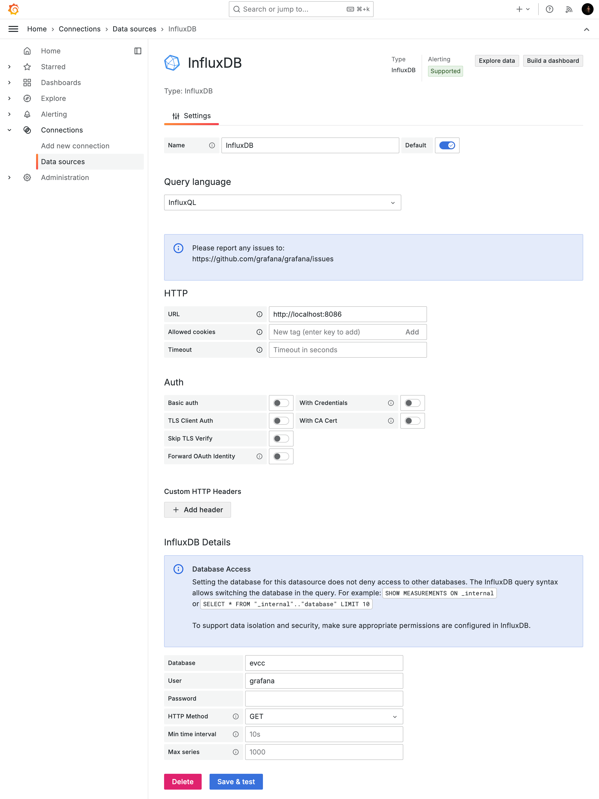
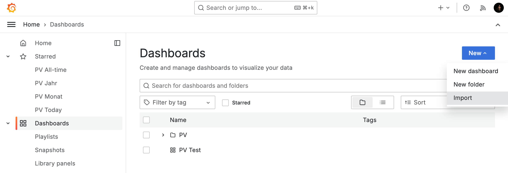
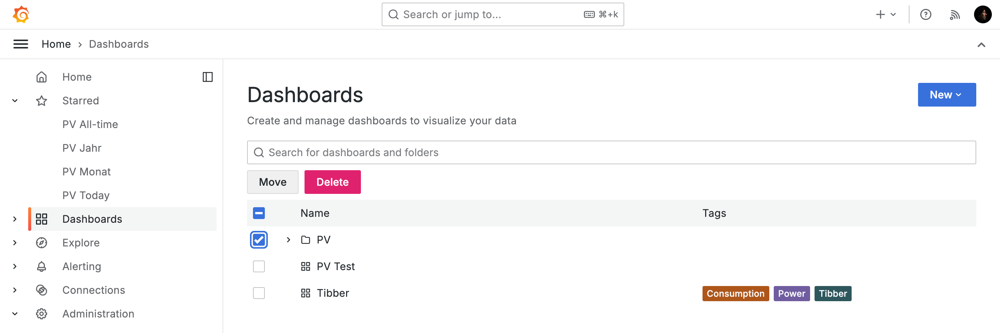

# Grafana Dashboard für EVCC

EVCC Dashboard mit Grafana für 2 Loadpoints und 2 Fahrzeuge. Loadpoints und Fahrzeuge können bei Bedarf einfach reduziert werden.

- Realtime Dashboard for Desktop, Tablet und Mobile.
- Monatliche und jährliche Übersicht.
- Berechnungen für Autarkie, Eigenverbrauch, sowie finanzielles Dashboard mit Kaptialrückflüssen und Amortisation.

Vorab: Ohne in Grafana einsteigen zu können, geht es nicht. Die Dashboards sind an meinen Bedürfnisse angepasst, so filtere ich in vielen Dashboards Ausreißer aus. Diese Werte müsst ihr ggf. anpassen. Zum Beispiel filtere ich bei meiner 9.84 kWp anlage alle Werte über 20 kW raus. Denkt bitte nicht, dass ihr meine Dashboards einfach in Grafana hochladen könnt und es wird bei Euch funktionieren. Seht das bitte eher als Startpunkt für eigene Dashboards.

Ich habe versucht alle notwendigen Anpassungen unter ['dashboards'](dashboards/README.md) aufzulisten. Dabei ist mir aber sicher was durch die Lappen gegangen.

## Installation

Installationsschritte für eine **frische, neue Installation**. Sollte in der Grafana Instanz schon eine ältere Version meines Dashboards installiert sein, bitte unten unter [Upgrade](#upgrade) weitermachen.

### Grundvoraussetzungen

Folgende Grundvoraussetzungen müssen erfüllt sein:

- EVCC: https://evcc.io/
- Influx DB v1.8 (InfluxDB 2.x wird nicht unterstützt, siehe FAQ): https://www.influxdata.com/
- Grafana: https://grafana.com/ (aktuell getestete Version: 11.2.0)
- Grundlegende Linux Kenntnisse oder die Bereitschaft sich diese anzueignen.
- Die Möglichkeit ein Bash Shell Script regelmäßig per Crontab ausführen zu können (HAOS Benutzer, siehe FAQ)
- Bereitschaft sich etwas in Grafana einzuarbeiten.

### Software

Hier nur die groben Schritte, da sie je nach Plattform stark variieren:

1. Influx DB 1.8.x installieren.
3. EVCC konfigurieren, dass Daten in die Influx geschrieben werden: https://docs.evcc.io/docs/reference/configuration/influx/
4. Grafana installieren

### Installation der Dashboards in Grafana

1. Data Source für Influx DB anlegen:

2. Dashboard [JSON Dateien](./dashboards) von diesem GitHub herunterladen.

3. JSON Dateien mittels 'New/Import' in Grafana importieren.

4. Dashboards wie [unter 'dashboards' beschrieben](./dashboards/README.md) anpassen.

5. Daten Aggregation Script wie [unter 'scripts beschrieben](./scripts/README.md) anpassen und installieren (ohne dieses werden die Dashboards für Monat, Jahr und Finanz nicht laufen).

## Upgrade

Falls schon eine ältere Version installiert worden ist, hier die Schritte um die neuere Version zu installieren.

> [!WARNING]
> Eigene Anpassungen an meinen Dashboards gehen bei diesem Prozess leider verloren und die Dashboards müssen erneut angepasst werden. Der Upgrade Prozess ist daher leider nicht so einfach, wie ich es mir wünschen würde.

1. Ein Backup der aktuellen Grafana Datenbank erstellen für den Fall der Fälle.
   1. Grafana stoppen: `sudo systemctl stop grafana-server`
   2. Ein Backup der Grafana Datenbank in /tmp erstellen: `cp -rv /usr/lib/grafana /tmp`
   3. Grafana starten: `sudo systemctl start grafana-server`
2. Grafana im Browser öffnen und im Menü auf 'Dashboards' clicken.
3. Den Ordner PV löschen, falls ihr hier keine eigenen Dashboards abgelegt habt. Ansonsten die einzelnen Dashboards, die ihr von mir bekommen habt, löschen.
   
4. Auf 'Dashboards/Library Panels' gehen. Dort alle Library Panels löschen, die von mir kommen.
5. Dashboard [JSON Dateien](./dashboards) von diesem GitHub herunterladen.
6. Zurück auf 'Dashboards' gehen.
7. JSON Dateien mittels 'New/Import' in Grafana importieren.
8. Dashboards wie [unter 'dashboards' beschrieben](./dashboards/README.md) anpassen.

## FAQ

### Wird es Support für Influx 2 geben?

Leider nur partiell. Wer Influx 2 mit FluxQL nutzt kann die Today Dashboards nutzen. Alle Dashboards, die aggregierte Daten brauchen werden allerdings nicht unterstützt, da ich derzeit keine Möglichkeit sehe mit dem Influx 2 CLI direkte Queries auszuführen (siehe #14). Eine Unterstützung der Query Language Flux bedeutet einen kompletten Rewrite. Diesen werde ich aber nicht machen, da Influx 2 mit Flux eine Einbahnstraße geworden ist. Siehe auch: [The Plan for InfluxDB 3.0 Open Source](https://www.influxdata.com/blog/the-plan-for-influxdb-3-0-open-source/)

### Wie führe ich das Aggregation Script unter HAOS aus?

Gute Frage. Leider ist mir derzeit keine Möglichkeit bekannt unter HAOS Shell Scripte direkt auszuführen. Wer eine Möglichkeit findet bitte Bescheid geben. 

Was ich evaluiert habe ist die Nutzung von Continuous Queries innerhalb von Influx. Leider stoße ich hier an andere Grenzen, da InfluxQL Funktionen wie $TODAY fehlen um die entsprechenden Queries formulieren zu können. 

Die einzige Möglichkeit, die ich hier sehe ist das Shell Script auf einem externen Linux System zu konfigurieren, das sich remote mit der Influx DB auf dem HAOS System verbindet. Siehe die [Dokumentation des Aggregations Scriptes](./scripts/README.md) wie man es so konfiguriert, dass man es auf einem externen Linux System laufen lassen kann.

# Danke

Herzlichen Dank an alle, die im Thread ["InfluxDB und Grafana"](https://github.com/evcc-io/evcc/discussions/4213) im EVCC Repository aktiv mitgeholfen haben. Ohne Eure Hilfe wäre das hier entweder nichts geworden oder hätte deutlich länger gedauert.
