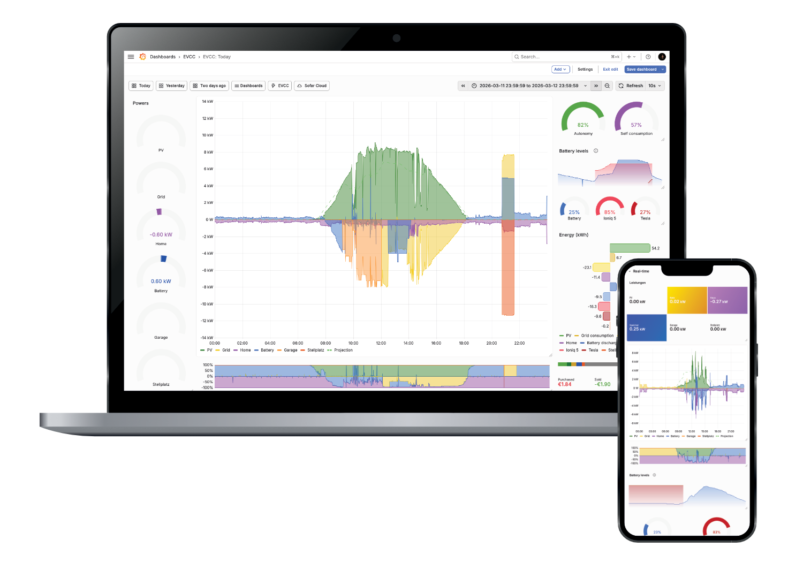

# Grafana dashboards for EVCC

> [!NOTE]
> The older dashboards for Influx DB 1.8 have been moved to the [`influx`](./influx/) subfolder.

A collection of EVCC dashboards for Grafana using Victoria Metrics:
- Real-time dashboards for desktop and mobile
- Detailed real-time statistics
- Monthly and yearly statistics
- Comprehensive all-time statistics, including financial calculations for PV system amortization and rough estimates of savings from electric vehicles

Please carefully review the next section, which lists the prerequisites, before you begin.

## Prerequisites

The following requirements must be met for these dashboards to work:

- EVCC: https://evcc.io/ (version 0.300 or newer recommended)
- Victoria Metrics (version v1.135 or higher recommended)
- Victoria Metrics [configured as a database in EVCC](https://docs.evcc.io/docs/reference/configuration/influx#victoriametrics)
- Grafana (version 12.3.0 or higher recommended)
- Basic Linux knowledge or willingness to learn
- Ability to regularly run a Bash shell script via crontab (HAOS users, see [FAQ](#faq))
- Willingness to learn a bit about Grafana

## Dashboard installation

### New installation
For detailed installation steps, see [installation.md](./installation.md).

### Migration from Influx 1.8
If you previously used the dashboards with Influx, see [migration.md](./migration.md) for instructions on migrating your existing Influx 1.8 database.

## FAQ

### Will there be support for new Influx versions?

No. Unfortunately, Influx has lost my support due to their product policy. For more details, see this [discussion](https://github.com/ha-puzzles/evcc-grafana-dashboards/discussions/220).

Main reasons:
- Influx does not provide a migration path for their own databases
- License model and restrictions of the free version in Influx 3

### How do I run the aggregation script under HAOS?

Good question. Unfortunately, I am not aware of any way to run shell scripts directly under HAOS (or similar systems without direct access). If you find a solution, please let me know.

To my knowledge, Victoria Metrics does not support quarter-hourly price calculations natively, so the script must implement additional logic.

The only option I see is to configure the shell script on an external Linux system that connects remotely to the Victoria Metrics database on the HAOS system. See the [aggregation script documentation](./scripts/README.md) for instructions on running it externally.

### After the upgrade, the dashboards look strange

Did you follow the upgrade steps, especially deleting the library panels, before importing the new dashboards?

### Some panels only show "No Data"

- Did you run the aggregation for all relevant time periods? See [scripts](./scripts/).
- Were the correct data sources selected during import? If not, you can change them later in the affected panels.