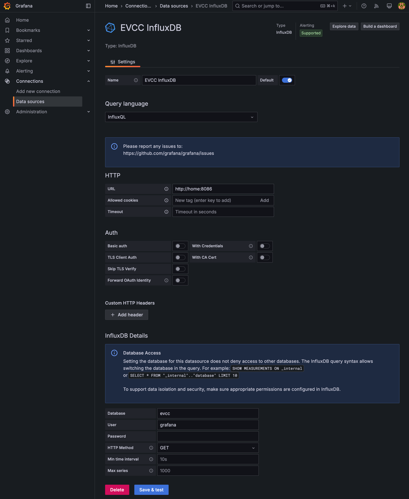
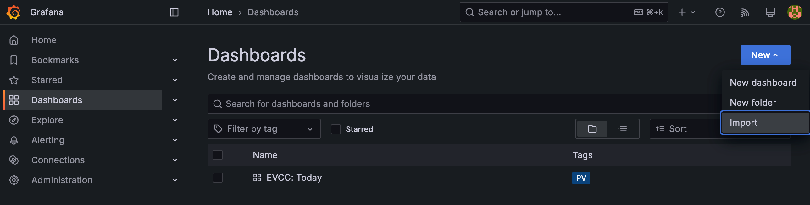
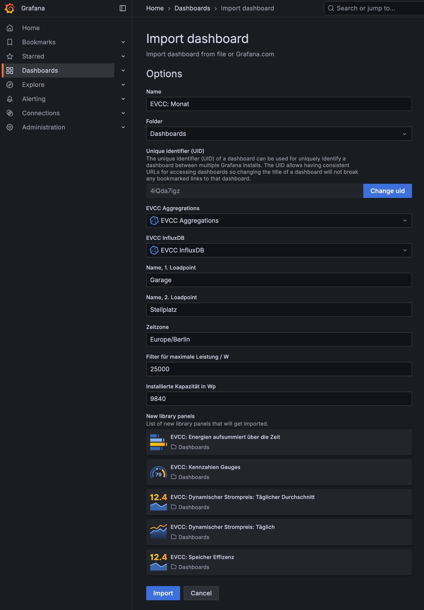
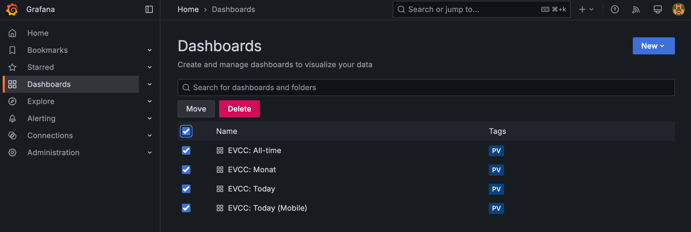
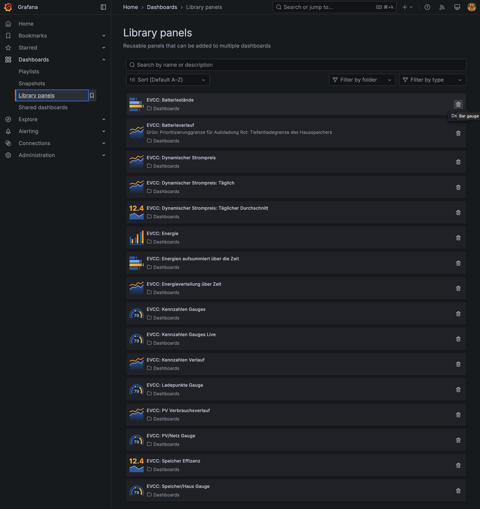

# Grafana Dashboard für EVCC

EVCC Dashboard mit Grafana für 2 Loadpoints und 2 Fahrzeuge. Loadpoints und Fahrzeuge können bei Bedarf einfach reduziert werden.

- Realtime Dashboard for Desktop, Tablet und Mobile.
- Monatliche und jährliche Übersicht.
- Berechnungen für Autarkie, Eigenverbrauch, sowie finanzielles Dashboard mit Kaptialrückflüssen und Amortisation.


Vorab: Ohne in Grafana einsteigen zu können, geht es nicht. Die Dashboards sind an meinen Bedürfnisse angepasst, so filtere ich in vielen Dashboards Ausreißer aus. Diese Werte müsst ihr ggf. anpassen. Zum Beispiel filtere ich bei meiner 9.84 kWp anlage alle Werte über 20 kW raus. Denkt bitte nicht, dass ihr meine Dashboards einfach in Grafana hochladen könnt und es wird bei Euch funktionieren. Seht das bitte eher als Startpunkt für eigene Dashboards.

Ich habe versucht alle notwendigen Anpassungen unter ['dashboards'](dashboards/README.md) aufzulisten. Dabei ist mir aber sicher was durch die Lappen gegangen.


## Installation

Installationsschritte für eine **frische, neue Installation**. Sollte in der Grafana Instanz schon eine ältere Version meines Dashboards installiert sein, bitte unten unter [Upgrade](#upgrade) weitermachen.

### Grundvoraussetzungen

Folgende Grundvoraussetzungen müssen erfüllt sein:

- EVCC: https://evcc.io/ (Version 0.200 oder neuer empfohlen)
- Influx DB v1.8 (InfluxDB 2.x wird nicht unterstützt, siehe FAQ): https://www.influxdata.com/
- Grafana: https://grafana.com/ (aktuell getestete Version: 11.5.0)
- Grundlegende Linux Kenntnisse oder die Bereitschaft sich diese anzueignen.
- Die Möglichkeit ein Bash Shell Script regelmäßig per Crontab ausführen zu können (HAOS Benutzer, siehe FAQ)
- Bereitschaft sich etwas in Grafana einzuarbeiten.


### Software

Hier nur die groben Schritte, da sie je nach Plattform stark variieren:

1. EVCC installieren und konfigurieren: https://docs.evcc.io/docs/installation
2. Influx DB 1.8.x installieren: https://docs.influxdata.com/influxdb/v1/introduction/install/
3. Datenbank für EVCC anlegen. Auf der Kommandozeile den Influx client mit dem Kommando `influx` ausführen. Dann folgende Kommandos eingeben:
   ```
   create database evcc
   use evcc
   create user grafana with password '' with all privileges
   grant all privileges on evcc to grafana
   exit
   ```
   Damit legen wir eine Datenbank mit dem Namen 'evcc' an und fügen dieser Datenbank einen User namens 'grafana' hinzu, der ohne Passwort vollen Zugriff hat. Dies ist natürlich nicht das sicherste Setup und es wird zumindest empfohlen dem User 'grafana' ein Passwort zu geben.
5. EVCC konfigurieren, dass Daten in die Influx geschrieben werden: https://docs.evcc.io/docs/reference/configuration/influx/
6. Grafana installieren: https://grafana.com/docs/grafana/latest/setup-grafana/installation/

Dieser Thread ["InfluxDB und Grafana"](https://github.com/evcc-io/evcc/discussions/4213) im EVCC Repository kann sehr hilfreich sein.

### Installation der Dashboards in Grafana


1. Daten Aggregations Script wie [unter 'scripts beschrieben](./scripts/README.md) anpassen und installieren (ohne dieses werden die Dashboards für Monat, Jahr und Finanz nicht laufen).

2. Data Sources unter 'Connections /  Data Sources' anlegen. 
   1. Oben rechts auf '+ Add new data source' clicken.
   2. 'InfluxDB' auswählen.
   3. Daten wie im Bild unten eintragen. 'URL', 'Database', 'User' und 'Passwort' müssen natürlich passend auf die eigene DB angepasst werden.
      
   4. Auf 'Save & test' clicken.
   5. Eine weitere Data Source für die Aggregations DB hinzufügen.
   6. Wieder Influx auswählen.
   7. Dieselben Daten, wie oben eintragen, aber
      - Name: 'EVCC Aggregations'
      - Database: 'evcc_aggr' (oder dieselbe DB wie oben, wenn keine getrennte DB gewünscht ist)

3. Dashboards über den Grafana.com Community Store installieren:
   1. In Grafana unter 'Dashboards' auf 'New/Import' clicken:
      
   2. Unter "Find and import dashboards..." folgende Dashboards mit folgenden IDs importieren:
      | Dashboard                | ID        |
      | ------------------------ | --------- |
      | EVCC: PV All-time:       | **22024** |
      | EVCC: PV Jahr:           | **22025** |
      | EVCC: PV Monat:          | **22026** |
      | EVCC: PV Today (Mobile): | **22027** |
      | EVCC: PV Today:          | **22028** |
      | EVCC: PV Today Details:  | **22956** |

4. Die Werte des Dashboards anpassen:
   1. Data Source auswählen. 'EVCC Influx DB' steht für die Datenbank, in die EVCC direkt schreibt. 'EVCC Aggregation' ist die Datenbank, in die das Aggregationsscript die aggregierten Daten schreibt. Weitere Variablen wie abgefragt ausfüllen. Diese können aber auch noch nach dem Import angepasst werden. Die Blockist Variablen würde ich nur bei Bedarf später ändern.
   2. Letzte Anpassungen in den Dashboards vornehmen. Siehe auch [unter 'dashboards'](./dashboards/README.md#anpassungen). 
   
   Der Screenshot zeigt den Import des Monatsdashboard. Die abgefragten Werte unterscheiden sich von Dashboard zu Dashboard.

   


## Upgrade

Falls schon eine ältere Version installiert worden ist, hier die Schritte um die neuere Version zu installieren.

> [!WARNING]
> Eigene Anpassungen an meinen Dashboards gehen bei diesem Prozess leider verloren und die Dashboards müssen erneut angepasst werden. Der Upgrade Prozess ist leider nicht so einfach, wie ich es mir wünschen würde.

1. Ein Backup der aktuellen Grafana Datenbank erstellen für den Fall der Fälle.
   1. Grafana stoppen: `sudo systemctl stop grafana-server`
   2. Ein Backup der Grafana Datenbank in /tmp erstellen: `cp -rv /var/lib/grafana /tmp`
   3. Grafana starten: `sudo systemctl start grafana-server`
2. Grafana im Browser öffnen und im Menü auf 'Dashboards' clicken.
3. Alle EVCC PV Dashboards löschen.

   
4. Auf 'Dashboards/Library Panels' gehen. **Dort alle Library Panels löschen, die von mir kommen.** Wird dies nicht gemacht, führt dies zu teilweise inkonsistenten Dashboards, welche das neue Dashboard mit alten Library Panels vermischen.
   
   
5. Dashboards über den Grafana.com Community Store installieren:
   1. In Grafana unter 'Dashboards' auf 'New/Import' clicken:
      
   2. Unter "Find and import dashboards..." folgende Dashboards mit folgenden IDs importieren:
      | Dashboard                | ID        |
      | ------------------------ | --------- |
      | EVCC: PV All-time:       | **22024** |
      | EVCC: PV Jahr:           | **22025** |
      | EVCC: PV Monat:          | **22026** |
      | EVCC: PV Today (Mobile): | **22027** |
      | EVCC: PV Today:          | **22028** |
      | EVCC: PV Today Details:  | **22956** |

6. Die Werte des Dashboards anpassen:
   1. Data Source auswählen. 'EVCC Influx DB' steht für die Datenbank, in die EVCC direkt schreibt. 'EVCC Aggregation' ist die Datenbank, in die das Aggregationsscript die aggregierten Daten schreibt. Weitere Variablen wie abgefragt ausfüllen. Diese können aber auch noch nach dem Import angepasst werden. Die Blockist Variablen würde ich nur bei Bedarf später ändern.
   2. Letzte Anpassungen in den Dashboards vornehmen. Siehe auch [unter 'dashboards'](./dashboards/README.md#anpassungen). 


## FAQ

### Wird es Support für Influx 2 geben?

Leider nur sehr eingeschränkt und daher nicht zu empfehlen. 

Wer Influx 2 mit InfluxQL nutzt kann die Today Dashboards nutzen. Alle Dashboards, die aggregierte Daten brauchen werden allerdings nicht unterstützt, da ich derzeit keine Möglichkeit sehe mit dem Influx 2 CLI direkte Queries auszuführen (siehe [#14](https://github.com/ha-puzzles/evcc-grafana-dashboards/issues/14)). Eine Unterstützung der Query Language Flux bedeutet einen kompletten Rewrite. Diesen Rewrite plane ich allerdings nicht zu machen, da Influx 2 mit Flux eine Einbahnstraße geworden ist. Siehe auch: [The Plan for InfluxDB 3.0 Open Source](https://www.influxdata.com/blog/the-plan-for-influxdb-3-0-open-source/)

### Wie führe ich das Aggregation Script unter HAOS aus?

Gute Frage. Leider ist mir derzeit keine Möglichkeit bekannt unter HAOS (oder ähnlichen Systemen ohne direkten Zugriff auf das System) Shell Scripte direkt auszuführen. Wer eine Möglichkeit findet bitte Bescheid geben. 

Was ich evaluiert habe ist die Nutzung von Continuous Queries innerhalb von Influx. Leider stoße ich hier an andere Grenzen, da InfluxQL Funktionen wie $TODAY fehlen um die entsprechenden Queries formulieren zu können. 

Die einzige Möglichkeit, die ich hier sehe ist das Shell Script auf einem externen Linux System zu konfigurieren, das sich remote mit der Influx DB auf dem HAOS System verbindet. Siehe die [Dokumentation des Aggregations Scriptes](./scripts/README.md) wie man es so konfiguriert, dass man es auf einem externen Linux System laufen lassen kann.

### Nach dem Upgrade sehen die Dashboards irgendwie komisch aus

Hast Du die Upgrade Schritte, insbesondere das Löschen der Library Panels befolgt, bevor Du die neuen Dashboards importiert hast?

### Ein paar Panele zeigen nur "No Data" an.

- Hast Du die Aggregation schon für alle betreffenden Zeiträume laufen gelassen? Siehe [scripts](./scripts/).
- Wurden beim Import die richtigen Data Sources ausgewählt? Falls nein, kann sie auch nachträglich in den betroffenen Panels noch geändert werden.


# Danke

Herzlichen Dank an alle, die im Thread ["InfluxDB und Grafana"](https://github.com/evcc-io/evcc/discussions/4213) im EVCC Repository aktiv mitgeholfen haben. Ohne Eure Hilfe wäre das hier entweder nichts geworden oder hätte deutlich länger gedauert.
