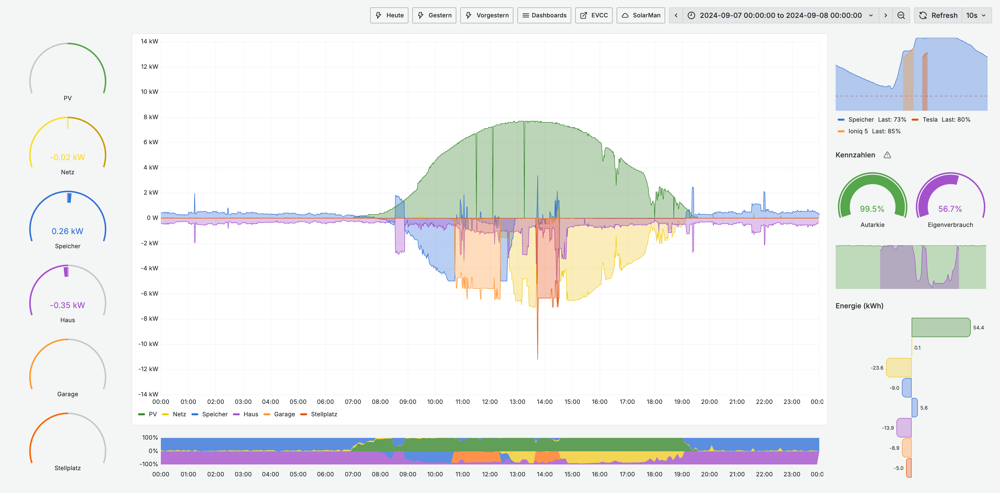
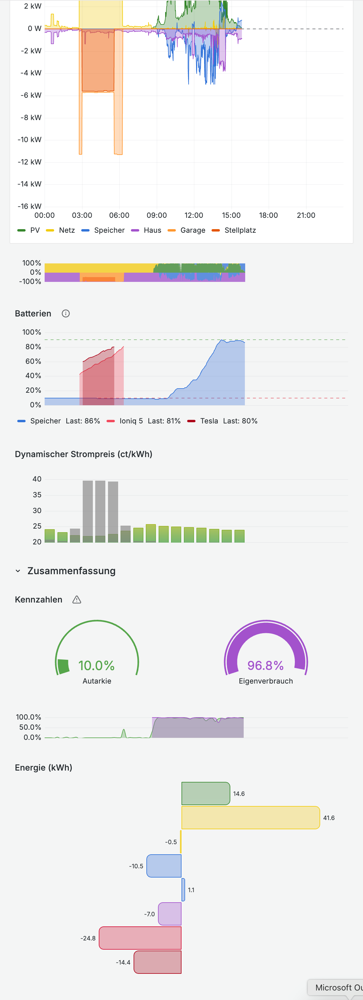
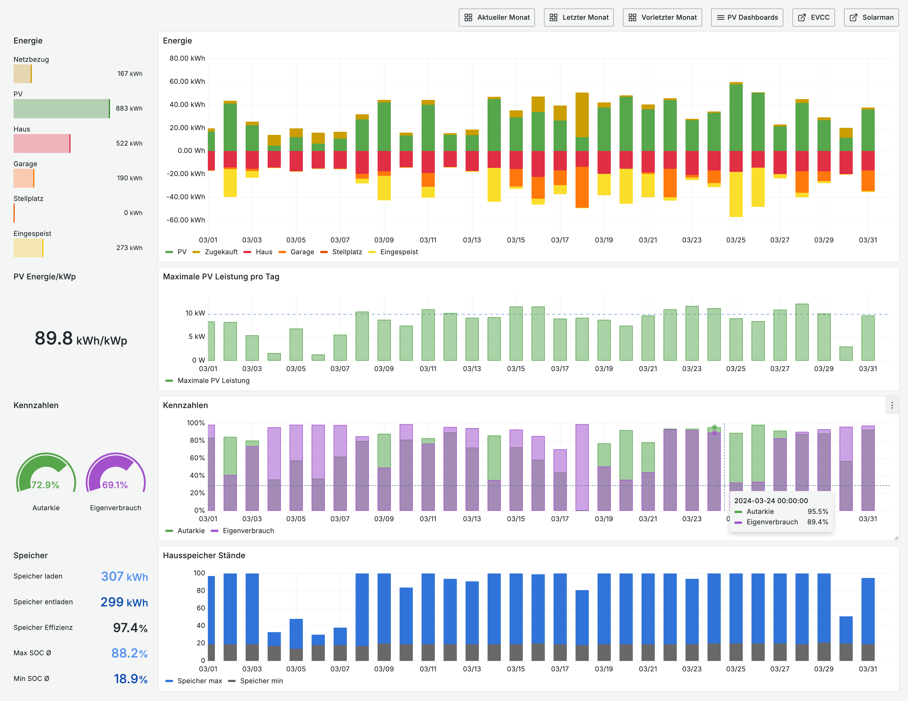
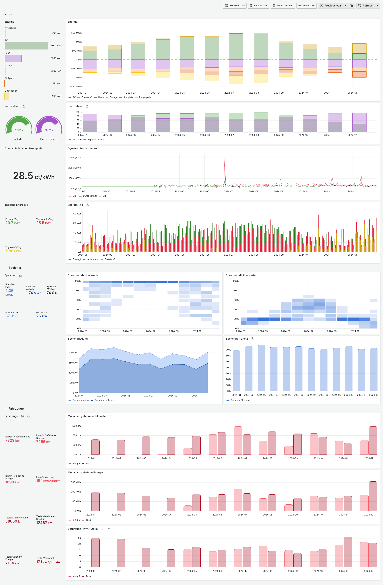
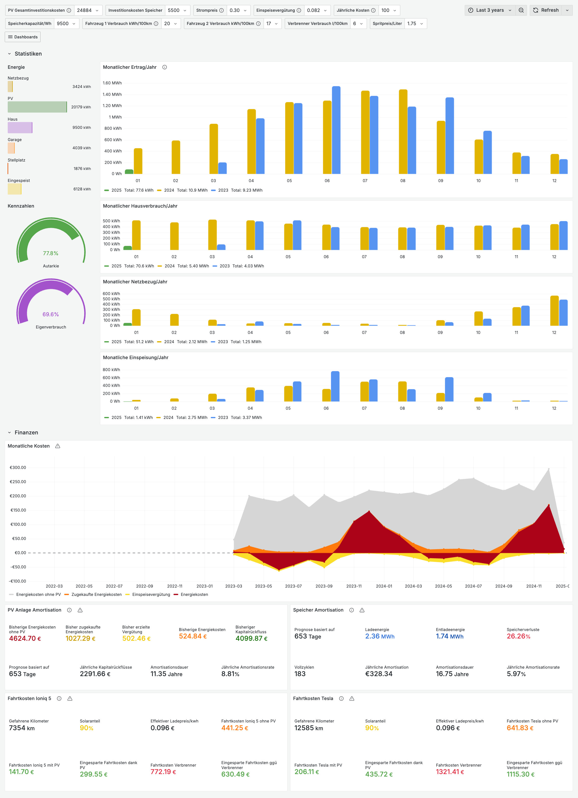
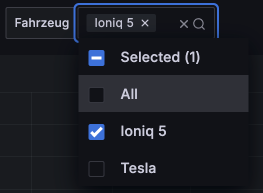
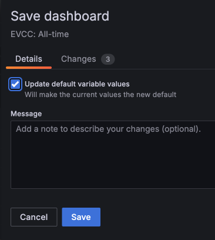

Wie diese Dashboards zu importieren sind, siehe [hier](../README.md).

# PV Today

Real-time Statistiken des aktuellen Tages für Desktops oder Tablets.

# PV Today (mobile)

Real-time Statistiken des aktuellen Tages, optimiert für mobile Geräte.

 

# PV Monat

Monatliche Statistiken.

> [!NOTE]
> Dieses Dashboard benötigt tägliche aggregierte Daten. Siehe [scripts](../scripts/) für das Aggregierungsskript.

# PV Jahr

Jährliche Statistiken.

> [!NOTE]
> Dieses Dashboard benötigt monatliche und tägliche aggregierte Daten. Siehe [scripts](../scripts/) für das Aggregierungsskript.

# PV All-time

*(Ehemals: PV-Finanz Dashboard)*

Statistiken über den gesamten erfassten  Datenzeitraum bestehend aus zwei Teilen:

- Energiestatistiken wie ein Jahr-zu-Jahr Vergleich der monatlichen Erträge.
- Finanzielle Statistiken zur Amortisation der Anlage. Sollte noch kein ganzes Jahr in der Datenbank vorhanden sein, wird anhand der aktuellen Daten eine Prognose für ein ganzes Jahr erstellt. Diese Prognose ist linear und natürlich sehr stark von der Jahreszeit der vorhanden Daten beeinflusst.

> [!NOTE]
> Dieses Dashboard benötigt monatliche aggregierte Daten. Siehe [scripts](../scripts/) für das Aggregierungsskript.

# Anpassungen

- All dashboards
  - Jedes Dashboard hat eigene Parameter. Da es leider keine globalen Variablen in Grafana gibt, müssen diese einmal pro Dashboard während des Imports angepasst werden.
  - Je nach Anzahl der Ladepunkte und der Fahrzeuge müssen einige Panelgrößen anpassen.
  - *Optional*: Die Ladepunkte und Fahrzeuge erhalten per default alle dieselben Farben. Um für verschiedene Ladepunkte und Fahrzeuge verschiedene Farben zu erhalten müssen in den jeweiligen Panels in Grafana die Overrides angepasst werden. Es sind schon Beispiele dabei für Ladepunkte (Garage, Stellplatz) und Fahrzeuge (Ioniq 5, Tesla). Hier muss in der Regel nur das Feld auf den richtigen Ladepunkt oder das richtige Fahrzeug gemappt werden. Ansonsten müssen weitere Overrides angelegt werden. 
- Today:
  - Anpassen von (Soft)Min und (Softt)Max angepasst werden müssen je nach maximaler Leistung von PV und Ladepunkten:
    - Gauges auf der linken Seite
    - Verlaufschart in der Mitte
    - Energie unten rechts
- All-time: 
  - Default Werte der Variablen, wie die Investitionskosten, anpassen.
  - *Optional*: Falls in den Fahrtkosten Panele unten "Fahrzeuge" (zum Beispiel eine Wärmepumpe) auftauchen, die hier nicht erscheinen sollen, oder falls bestimmte Fahrzeuge ausgeblendet werden soll, dann diesen Schritten folgen:
    1. Dashboard editieren und in den Settings zum 'Variablen' tab gehen
    2. Auf die Variable 'vehicle' klicken.
    3. Unter 'Show on dashboard' den Wert 'Label and value` auswählen.
    4. Oben rechts auf das Dashboard zurückgehen. Nun taucht hier eine Auswahlbox oben für das Fahrzeug auf. Hier ist 'All' vorausgewählt. Diese Auswahl auf die gewünschten Fahrzeuge ändern:
       
       
    5. *Optional*: Mit Schritt 1-3 die variable wieder verstecken, wenn man sie nicht mehr sehen will.
    6. Dashboard abspeichern. Dabei 'Update default variable values' auswählen.

       
