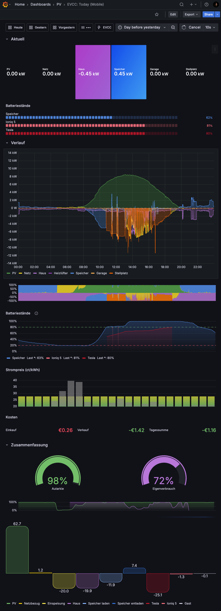
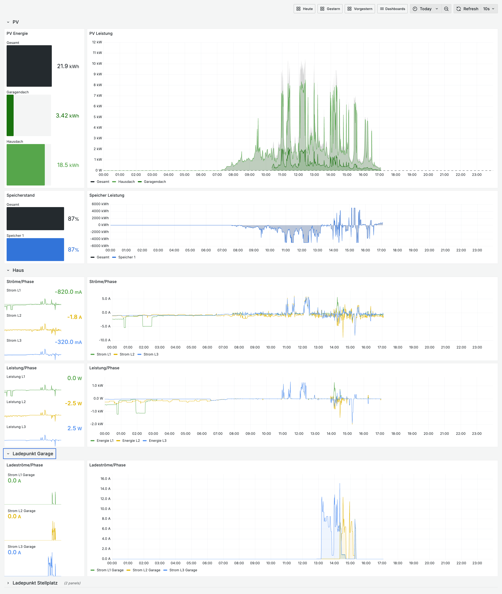
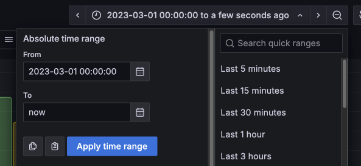

Wie diese Dashboards zu importieren sind, siehe [hier](../README.md).

# Today

Real-time Statistiken des aktuellen Tages für Desktops oder Tablets.


# Today (mobile)

Real-time Statistiken des aktuellen Tages, optimiert für mobile Geräte.




# Today Details

Weitere Details, die bei der Fehlersuche helfen können wie 
- die Leistung der einzelnen PVs oder Batteriemodule, falls mehrere konfiguriert sind.
- Leistung und Ströme der einzelnen Phasen
- Ladeströme der Wallboxen



# Monat

Monatliche Statistiken.

> [!NOTE]
> Dieses Dashboard benötigt tägliche aggregierte Daten. Siehe [scripts](../scripts/) für das Aggregierungsskript.


# Jahr

Jährliche Statistiken.

> [!NOTE]
> Dieses Dashboard benötigt monatliche und tägliche aggregierte Daten. Siehe [scripts](../scripts/) für das Aggregierungsskript.


# All-time

*(Ehemals: PV-Finanz Dashboard)*

Statistiken über den gesamten erfassten  Datenzeitraum bestehend aus zwei Teilen:

- Energiestatistiken wie ein Jahr-zu-Jahr Vergleich der monatlichen Erträge.
- Finanzielle Statistiken zur Amortisation der Anlage. Sollte noch kein ganzes Jahr in der Datenbank vorhanden sein, wird anhand der aktuellen Daten eine Prognose für ein ganzes Jahr erstellt. Diese Prognose ist linear und natürlich sehr stark von der Jahreszeit der vorhanden Daten beeinflusst.


> [!NOTE]
> Dieses Dashboard benötigt täglich und monatlich aggregierte Daten. Siehe [scripts](../scripts/) für das Aggregierungsskript.


# Anpassungen

Ganz ohne manuelle Anpassungen geht es leider nicht. Hier einige Dinge, die noch nach dem Import gemacht werden müssen.

## Gemeinsame Einstellungen von allen Dashboards
- Jedes Dashboard hat eigene Parameter. Da es leider keine globalen Variablen in Grafana gibt, müssen diese einmal pro Dashboard während des Imports angepasst werden.
- Je nach Anzahl der Ladepunkte und der Fahrzeuge müssen einige Panelgrößen anpassen.
- *Optional*: Die Ladepunkte und Fahrzeuge erhalten per default alle dieselben Farben. Um für verschiedene Ladepunkte und Fahrzeuge verschiedene Farben zu erhalten müssen in den jeweiligen Panels in Grafana die Overrides angepasst werden. Es sind schon Beispiele dabei für Ladepunkte (Garage, Stellplatz) und Fahrzeuge (Ioniq 5, Tesla). Hier muss in der Regel nur das Feld auf den richtigen Ladepunkt oder das richtige Fahrzeug gemappt werden. Ansonsten müssen weitere Overrides angelegt werden. 
- *Optional*: Falls Ladepunkte oder Fahrzeuge angezeigt werden, die man nicht sehen will (zum Beispiel weil während der Einrichtung etwas mehrfach umbenannt worden ist), kann man in den Dashboard Einstellungen die Variablen 'loadpointBlockist' und 'vehicleBlockist' anpassen.
  - Dashboard in den Edit Mode versetzen.
  - Auf 'Settings' klicken.
  - Auf dem Tab 'Variables' auf die Variablen Klicken
  - Wert anpassen. Der Wert ist eine reguläre Expression mit dem Einträge gematched werden, die NICHT angezeigt werden sollen. Er muss mit einem Schrägstrich beginnen und Enden und darf nicht leer sein. Wenn nichts gefiltert werden soll, muss hier eine Expressions stehen, die keinen der Werte matched.

    Beispiele:
    | Beschreibung | Pattern |
    | ------------ | ------- |
    | Nichts filtern (außer ein Eintrag würde 'none' lauten) | `/^none$/` |
    | Filtere 'Garage' aus | `/^Garage$/` |
    | Filtere 'Garage' und 'Stellplatz' aus | `/^Garage$\|^Stellplatz$/` |
    | Filtere alles, das mit 'Mr White' beginnt aus | `/^Mr White.*$/` |
    | Filtere alles, das mit '(offline)' endet aus | `/^.*\(offline\)$/` |

## EVCC: Today und EVCC: Today (Mobile)
- Anpassen von (Soft)Min und (Softt)Max je nach maximaler Leistung von PV und Ladepunkten in folgenden Panels:
  - Gauges auf der linken Seite
  - Verlaufschart in der Mitte
  - Energie unten rechts

## EVCC: Today - Details
- Mittels overrides können den einzelnen PV Teilen Namen zugewiesen werden.
- Formel für 'Sonstige' Verbraucher: Siehe [Formel für 'Sonstige' anpassen](#formel-für-sonstige-anpassen). 

## EVCC: Monat
- Formel für 'Sonstige' Verbraucher: Siehe [Formel für 'Sonstige' anpassen](#formel-für-sonstige-anpassen). 

## EVCC: Jahr
- Formel für 'Sonstige' Verbraucher: Siehe [Formel für 'Sonstige' anpassen](#formel-für-sonstige-anpassen). 

## EVCC: All-time
- Unter den Dashboard Settings die Default Werte der Variablen, wie die Investitionskosten, anpassen.
- Zeitraum anpassen: Startdatum unter 'From' auswählen und in 'To' muss `now` stehen.

  

  Danach das Dashboard speichern und dabei die ausgewählte Zeit mit abspeichern.
- *Optional*: Falls in den Fahrtkosten Panele unten "Fahrzeuge" (zum Beispiel eine Wärmepumpe) auftauchen, die hier nicht erscheinen sollen, oder falls bestimmte Fahrzeuge temporär ohne Anpassung der Blockist ein-und ausgeblendet werden soll, dann diesen Schritten folgen:
  1. Dashboard editieren und in den Settings zum 'Variablen' tab gehen
  2. Auf die Variable 'vehicle' klicken.
  3. Unter 'Show on dashboard' den Wert 'Label and value` auswählen.
  4. Oben rechts auf das Dashboard zurückgehen. Nun taucht hier eine Auswahlbox oben für das Fahrzeug auf. Hier ist 'All' vorausgewählt. Diese Auswahl auf die gewünschten Fahrzeuge ändern:
      
    
  5. *Optional*: Mit Schritt 1-3 die variable wieder verstecken, wenn man sie nicht mehr sehen will. Oder einfach sichtbar lassen, dann kann man die Auswahl in Zukunft schnell ändern.
  2. Dashboard abspeichern. Dabei 'Update default variable values' auswählen.

    


## Formel für 'Sonstige' anpassen

In den Dashboards 'EVCC: Today - Details', 'EVCC: Monat', und 'EVCC:Jahr' müssen gegebenenfalls die Formeln für die sonstigen Verbraucher, die nicht von den einzeln gemessenen Geräten erfasst werden, angepasst werden.

1. Feststellen ob AUX ('Self-regulating consumer') oder/und EXT ('Regular consumer') verwendet werden.
   1. 'EVCC: Today - Details' öffnen.
   2. Oben rechts auf 'Edit' klicken um in den Edit Mode zu kommen.
   3. Das Donut Chart 'Haus: Aktuelle Leistung' editieren. Im Panel Menü auf 'Edit' klicken.
   4. Unten links die Queries 'extPowers' und 'auxPowers' unsichtbar und sichtbar schalten. Ändern sich dabei jeweils die Einträge in der Liste? Dann sind EXT, bzw. AUX Geräte verfügbar.
   
2. Die Formel für 'Sonstige' anpassen.
   * Es gibt nur AUX Geräte:
     ```
     $totalHomePower - $auxPowersSum
     ```
   * Es gibt nur EXT Geräte:
     ```
     $totalHomePower - $extPowersSum
     ```
   * Es gibt AUX und EXT Geräte:
     ```
     $totalHomePower - $auxPowersSum - $extPowersSum
     ```
3. Schritt 2 für folgende Widgets durchführen
   * 'EVCC: Today - Details'
     * 'Haus: Aktuelle Leistung' (wurde bereits erledigt)
     * 'Haus: Leistung'
     * 'Haus: Energieverteilung'
     * 'Haus: Energieverbrauch'
   * 'EVCC: Monat'
     * 'Haus: Energieverteilung'
     * 'Haus: Energieverbrauch'
   * 'EVCC: Jahr'
     * 'Haus: Energieverteilung'
     * 'Haus: Energieverbrauch'