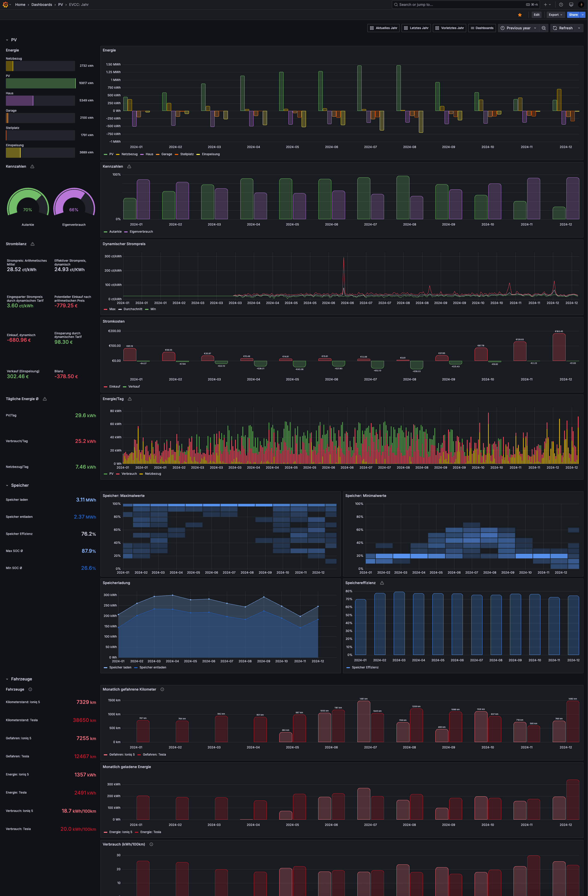
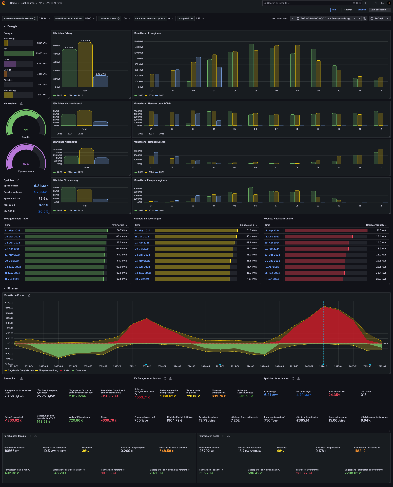

Wie diese Dashboards zu importieren sind, siehe [hier](../README.md).

# PV Today

Real-time Statistiken des aktuellen Tages für Desktops oder Tablets.

## Was anzupassen ist
- Dashboard Settings / Links
  - Link auf EVCC
  - Link auf die Seite Eures Wechselrichterportals
- Ladepunkte Gauges
  - Namen der Loadpoints in den Queries, so wie ihr sie in EVCC konfiguriert habt.
  - In den Queries, der Alias, wie ihr die Loadpoints angezeigt haben möchtet
    - Dann die neuen Namen in den Overrides aktualisieren ("Fields with name")
- Batterie- und Speicherverlauf
  - Name der Fahrzeuge in den Queries, so wie der Titel, der in EVCC konfiguriert wurde.
    - Dann die neuen Namen in den Overrides aktualisieren ("Fields with name")
- Verbrauchsverlauf
  - In den Queries habe ich die Werte auf kleiner als 20 kW beschränkt um falsche Werte herauszufiltern. Falls Eure Leistungen hin und wieder 20kW überschreiten, müsst ihr diese Einschränkung in den Queries erhöhen.
- Energieverteilung
  - In den Queries habe ich die Werte auf kleiner als 20 kW beschränkt um falsche Werte herauszufiltern. Falls Eure Leistungen hin und wieder 20kW überschreiten, müsst ihr diese Einschränkung in den Queries erhöhen.
- Kennzahlen
  - In den Queries habe ich die Werte auf kleiner als 20 kW beschränkt um falsche Werte herauszufiltern. Falls Eure Leistungen hin und wieder 20kW überschreiten, müsst ihr diese Einschränkung in den Queries erhöhen.
- Kennzahlenverlauf
  - In den Queries habe ich die Werte auf kleiner als 20 kW beschränkt um falsche Werte herauszufiltern. Falls Eure Leistungen hin und wieder 20kW überschreiten, müsst ihr diese Einschränkung in den Queries erhöhen.
- Energie Übersicht (unten rechts)
  - Name der Fahrzeuge in den Queries, so wie der Titel, der in EVCC konfiguriert wurde.
    - Dann die neuen Namen in den Overrides aktualisieren ("Fields with name")
  - In den Queries habe ich die Werte auf kleiner als 20 kW beschränkt um falsche Werte herauszufiltern. Falls Eure Leistungen hin und wieder 20kW überschreiten, müsst ihr diese Einschränkung in den Queries erhöhen.

# PV Today (mobile)

Real-time Statistiken des aktuellen Tages, optimiert für mobile Geräte.

 

## Was anzupassen ist

- Dashboard Settings / Links
  - Link auf EVCC
  - Link auf die Seite Eures Wechselrichterportals

Die restlichen Statistiken wurden bereits mit der Desktop Ansicht oben angepasst, da das mobile Dashboard dieselben Library Panels benutzt

# PV Monat

Monatliche Statistiken.

> [!NOTE]
> Dieses Dashboard benötigt tägliche aggregierte Daten. Siehe [scripts](../scripts/) für das Aggregierungsskript.

## Was anzupassen ist

- Energie Übersicht
  - Namen der Loadpoints in den Queries, so wie ihr sie in EVCC konfiguriert habt.
  - In den Queries, der Alias, wie ihr die Loadpoints angezeigt haben möchtet
    - Dann die neuen Namen in den Overrides aktualisieren ("Fields with name")
- Energie pro Tag
  - Namen der Loadpoints in den Queries, so wie ihr sie in EVCC konfiguriert habt.
  - In den Queries, der Alias, wie ihr die Loadpoints angezeigt haben möchtet
    - Dann die neuen Namen in den Overrides aktualisieren ("Fields with name")

# PV Jahr

Jährliche Statistiken.

> [!NOTE]
> Dieses Dashboard benötigt monatliche und tägliche aggregierte Daten. Siehe [scripts](../scripts/) für das Aggregierungsskript.

## Was anzupassen ist

- Energie Übersicht
  - Namen der Loadpoints in den Queries, so wie ihr sie in EVCC konfiguriert habt.
  - In den Queries, der Alias, wie ihr die Loadpoints angezeigt haben möchtet
    - Dann die neuen Namen in den Overrides aktualisieren ("Fields with name")
- Energie pro Tag
  - Namen der Loadpoints in den Queries, so wie ihr sie in EVCC konfiguriert habt.
  - In den Queries, der Alias, wie ihr die Loadpoints angezeigt haben möchtet
    - Dann die neuen Namen in den Overrides aktualisieren ("Fields with name")

# PV All-time

*(Ehemals: PV-Finanz Dashboard)*

Statistiken über den gesamten erfassten  Datenzeitraum bestehend aus zwei Teilen:

- Energiestatistiken wie ein Jahr-zu-Jahr Vergleich der monatlichen Erträge.
- Finanzielle Statistiken zur Amortisation der Anlage. Sollte noch kein ganzes Jahr in der Datenbank vorhanden sein, wird anhand der aktuellen Daten eine Prognose für ein ganzes Jahr erstellt. Diese Prognose ist linear und natürlich sehr stark von der Jahreszeit der vorhanden Daten beeinflusst.

> [!NOTE]
> Dieses Dashboard benötigt monatliche aggregierte Daten. Siehe [scripts](../scripts/) für das Aggregierungsskript.

## Was anzupassen ist

- Dashboard Settings / Variables
  - Default Werte für Deine Situation anpassen: Anschaffungspreis, Strompreis,...
- Dashboard Zeitraum, wenn ein weiteres Jahr dazu kommt.
- Monatlicher Ertag
  - Overrides für Jahr Display Label, wenn ein neues Jahr dazukommt solange grafana/grafana#87332 noch nicht gefixt ist.
