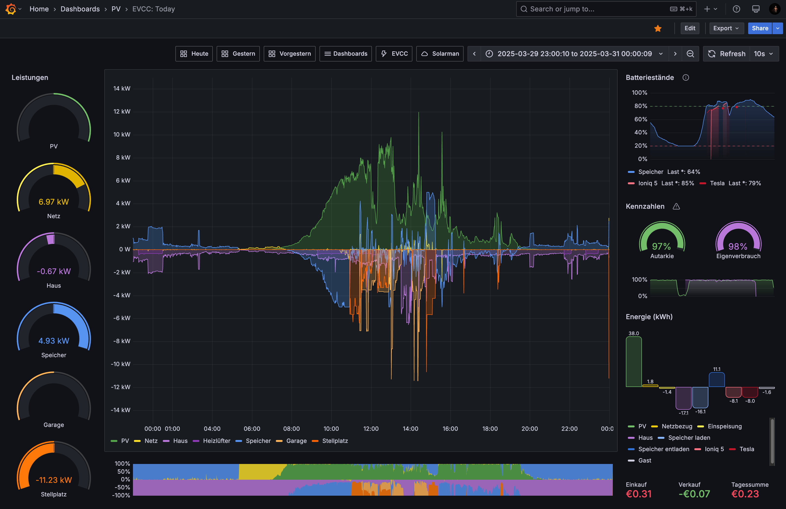
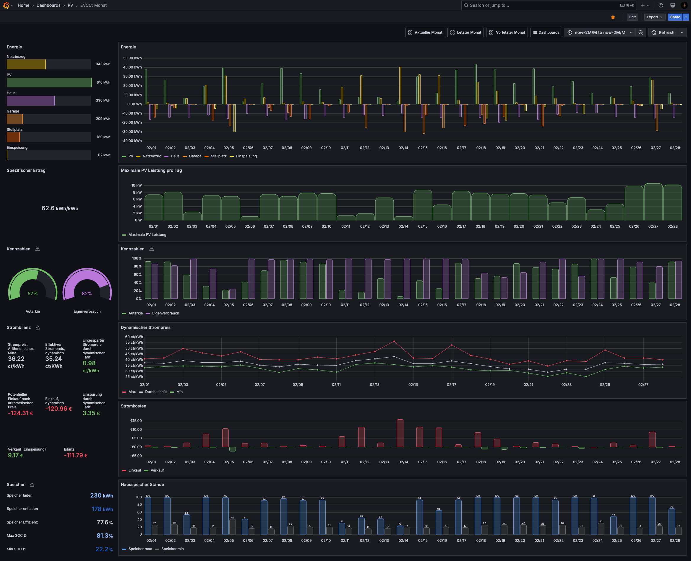

Wie diese Dashboards zu importieren sind, siehe [hier](../README.md).

# PV Today

Real-time Statistiken des aktuellen Tages für Desktops oder Tablets.

# PV Today (mobile)

Real-time Statistiken des aktuellen Tages, optimiert für mobile Geräte.

 

# PV Monat

Monatliche Statistiken.

> [!NOTE]
> Dieses Dashboard benötigt tägliche aggregierte Daten. Siehe [scripts](../scripts/) für das Aggregierungsskript.

# PV Jahr

Jährliche Statistiken.

> [!NOTE]
> Dieses Dashboard benötigt monatliche und tägliche aggregierte Daten. Siehe [scripts](../scripts/) für das Aggregierungsskript.

# PV All-time

*(Ehemals: PV-Finanz Dashboard)*

Statistiken über den gesamten erfassten  Datenzeitraum bestehend aus zwei Teilen:

- Energiestatistiken wie ein Jahr-zu-Jahr Vergleich der monatlichen Erträge.
- Finanzielle Statistiken zur Amortisation der Anlage. Sollte noch kein ganzes Jahr in der Datenbank vorhanden sein, wird anhand der aktuellen Daten eine Prognose für ein ganzes Jahr erstellt. Diese Prognose ist linear und natürlich sehr stark von der Jahreszeit der vorhanden Daten beeinflusst.

> [!NOTE]
> Dieses Dashboard benötigt monatliche aggregierte Daten. Siehe [scripts](../scripts/) für das Aggregierungsskript.

# Notwendige Anpassungen

Jedes Dashboard hat eigene Parameter. Da es leider keine globalen Variablen in Grafana gibt, müssen diese einmal pro Dashboard angepasst werden.

Gehe in die Einstellungen des Dashboards und dort auf den Tab 'Variables'. Klicke nun auf jede Variable und passe die Werte an. Du findest dort jeweils Beschreibungen, die den Parameter erklären.

In einigen Panels werden die Bereiche für Min und Max angepasst werden müssen.