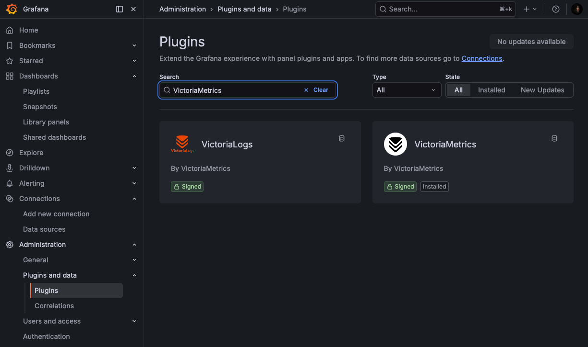
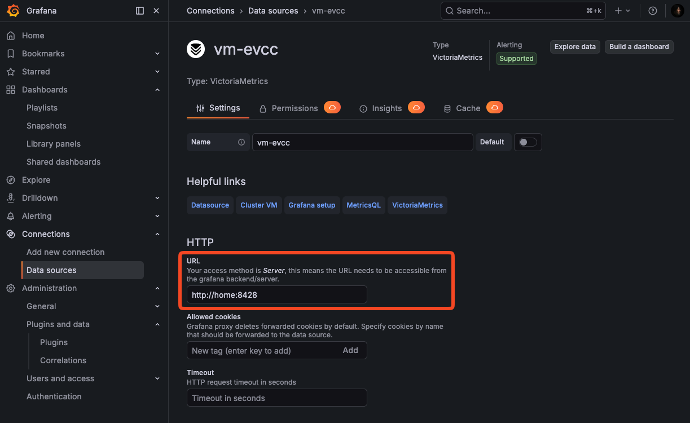
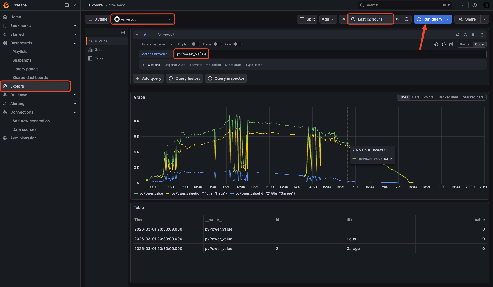

# Migration

Beschreibt die Migration von Influx 1.8 mit oder ohne den alten Dashboards (Version 1.x oder älter) auf Victoria Metrics mit den neuen Dashboards (Version 2.x).

## Überblick der Schritte

Vorsichtige Migration mit vorherigem Test (empfohlen):
1. Installation von Victoria Metrics.
1. Migration der Daten von Influx 1.8 nach Victoria Metrics.
1. Installation der neuen Victoria Metrics basierten Dashboards parallel zu den alten Dashboards.
1. Aggregationscript installieren und ausführen.
1. Testen der neuen Dashboards.
1. Nach erfolgreichem Test: Umkonfiguration von EVCC, damit die Daten in Victoria Metrics geschrieben werden.
1. Erneuerter Import der Daten von Influx 1.8 nach Victoria Metrics, damit die zwischenzeitlich seit dem 2. Schritt geschriebenen Daten auch in Victoria Metrics vorhanden sind.
1. Erneute Ausführung des Aggregationsscriptes.
1. Löschen der alten Dashboards und Library Panels.

Optimistische Migration:
1. Installation von Victoria Metrics.
1. Umkonfiguration von EVCC, damit die Daten in Victoria Metrics und nicht länger in Influx DB geschrieben werden.
1. Import der Daten von Influx 1.8 nach Victoria Metrics.
1. Installation der neuen Victoria Metrics basierten Dashboards.
1. Aggregationscript installieren und ausführen.
1. Löschen der alten Dashboards und Library Panels.


## Installation von Victoria Metrics

Hier gibt es mehrere Methoden. Wichtig bei allen ist, dass wir die Retention Period erhöhen.

Zu den Details der Installation siehe [vm-installation.md](./vm-installation.md)

## Migration

1. In einer früheren Influx Version wurde das Measurement `batteryControllable` geschrieben. Dieses enthielt keine gültigen Zahlen als Metric und muss vor der Migration gelöscht werden.
   ```bash
   influx -database evcc -execute 'drop measurement batteryControllable'
   ```
   Der Datenbankname muss eventuell angepasst werden und die parameter `-username <user>` und `-password <password>` könnten auch noch notwendig sein.
1. Der Import der Daten aus der Influx DB wird nun durch dieses Kommando gestartet:
   - Installation über Docker
      ```bash
      sudo docker run -it --rm victoriametrics/vmctl:latest influx --influx-addr=http://127.0.0.1:8086 --influx-database=evcc --vm-addr=http://127.0.0.1:8428 
      ```
      Sollten User und Password für Influx notwendig sein, dann
      ```bash
      sudo docker run -it --rm victoriametrics/vmctl:latest influx --influx-addr=http://127.0.0.1:8086 --influx-database=evcc --influx-user <user> --influx-password <password> --vm-addr=http://127.0.0.1:8428 
      ```
      `<user>` und `<password>` sind entsprechend anzupassen.

   - lokale Installation
      ```bash
      vmctl influx --influx-addr=http://127.0.0.1:8086 --influx-database=evcc --vm-addr=http://127.0.0.1:8428 
      ```
      Sollten User und Password für Influx notwendig sein, dann
      ```bash
      vmctl influx --influx-addr=http://127.0.0.1:8086 --influx-database=evcc --influx-user <user> --influx-password <password> --vm-addr=http://127.0.0.1:8428 
      ```
      `<user>` und `<password>` sind entsprechend anzupassen.

## Grafana Setup
1. In Grafana gehen wir zu 'Administration > Plugins and data > Plugins` und suchen dort das 'VictoriaMetrics' Plugin und installieren es.
   
1. Nun legen wir eine unter `Connections > Data sources` eine neue Verbindung zu unserer Datenbank an. Unter 'URL' geben wir `http://<server>>:8428` ein. Scrollen bis ganz nach untern und clicken auf `Save & test`.
   
1. Jetzt kann man in Grafana über Explore schon die importierten Daten anschauen. Oben die eben angelegte Data Source auswählen, die Zeit auf einen sinnvollen Bereich einstellen und unter 'Metric browser' zum Beispiel die Metric `pvPower_value` auswählen. Dann auf 'Run query' clicken und man sollte die importierten Daten sehen.
   

> [!NOTE]
> Von Influx importierte Metriken findet man nun unter `<Influx Measurement Name>_<Wert>` und `<Wert>` ist bei den meisten Measurements 'value'. Also hat man früher zum Beispiel aus dem Measurement 'pvPower' den Wert 'value' abgefragt, dann findet man diesen nun unter der Metric 'pvPower_value'.

## Import der neuen Dashboards

TODO (eventuell weiter unter installation.md)