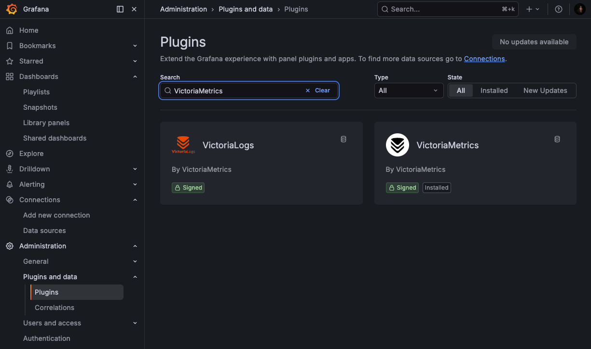
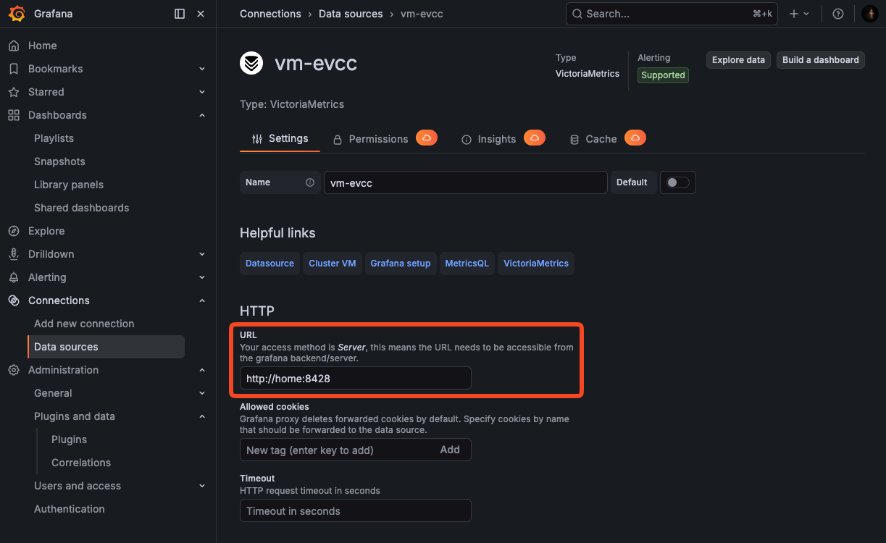
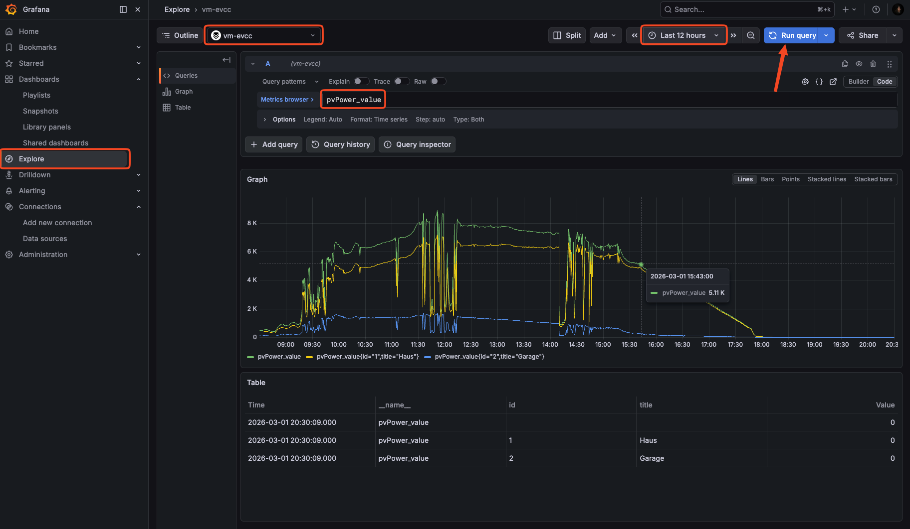

# Migration

This guide describes how to migrate from Influx 1.8 (with or without the old dashboards, version 1.x or earlier) to Victoria Metrics with the new dashboards (version 2.x).

## Step overview

Recommended migration with prior testing:
1. Install Victoria Metrics.
1. Migrate data from Influx 1.8 to Victoria Metrics.
1. Install the new Victoria Metrics-based dashboards alongside the old dashboards.
1. Install and run the aggregation script.
1. Test the new dashboards.
1. After successful testing, reconfigure EVCC to write data to Victoria Metrics.
1. Re-import data from Influx 1.8 to Victoria Metrics so that any data written since step 2 is also available in Victoria Metrics.
1. Run the aggregation script again.
1. Delete the old dashboards and library panels.

Optimistic migration:
1. Install Victoria Metrics.
1. Reconfigure EVCC to write data to Victoria Metrics instead of Influx DB.
1. Import data from Influx 1.8 to Victoria Metrics.
1. Install the new Victoria Metrics-based dashboards.
1. Install and run the aggregation script.
1. Delete the old dashboards and library panels.

## Installing Victoria Metrics

There are several installation methods. For all of them, it is important to increase the retention period.

For installation details, see [vm-installation.md](./vm-installation.md)

## Migration

1. In earlier versions of Influx, the measurement `batteryControllable` was written. This did not contain valid numbers as a metric and must be deleted before migration.
   ```bash
   influx -database evcc -execute 'drop measurement batteryControllable'
   ```
   You may need to adjust the database name, and the parameters `-username <user>` and `-password <password>` may also be required.
1. Start importing data from Influx DB using the following commands:
   - Docker installation
      ```bash
      sudo docker run -it --rm victoriametrics/vmctl:latest influx --influx-addr=http://127.0.0.1:8086 --influx-database=evcc --vm-addr=http://127.0.0.1:8428 --influx-skip-database-label
      ```
      If a username and password are required for Influx:
      ```bash
      sudo docker run -it --rm victoriametrics/vmctl:latest influx --influx-addr=http://127.0.0.1:8086 --influx-database=evcc --influx-user <user> --influx-password <password> --vm-addr=http://127.0.0.1:8428  --influx-skip-database-label
      ```
      Adjust `<user>` and `<password>` as needed.

   - Local installation
      ```bash
      vmctl influx --influx-addr=http://127.0.0.1:8086 --influx-database=evcc --vm-addr=http://127.0.0.1:8428  --influx-skip-database-label
      ```
      If a username and password are required for Influx:
      ```bash
      vmctl influx --influx-addr=http://127.0.0.1:8086 --influx-database=evcc --influx-user <user> --influx-password <password> --vm-addr=http://127.0.0.1:8428  --influx-skip-database-label
      ```
      Adjust `<user>` and `<password>` as needed.

## Grafana setup
1. In Grafana, go to 'Administration > Plugins and data > Plugins', search for the 'VictoriaMetrics' plugin, and install it.

   
   
1. Under `Connections > Data sources`, create a new connection to your database. In the 'URL' field, enter `http://<server>:8428`. Scroll to the bottom and click `Save & test`.

   

1. You can now use Grafana Explore to view the imported data. Select the data source you just created at the top, set the time range to a meaningful period, and in the 'Metric browser', select a metric such as `pvPower_value`. Click 'Run query' to view the imported data.

   

> [!NOTE]
> Metrics imported from Influx are now found under `<Influx Measurement Name>_<Value>`, where `<Value>` is usually 'value' for most measurements. For example, if you previously queried the value 'value' from the measurement 'pvPower', you will now find it under the metric 'pvPower_value'.

## Importing the new dashboards

TODO (possibly further in installation.md)
