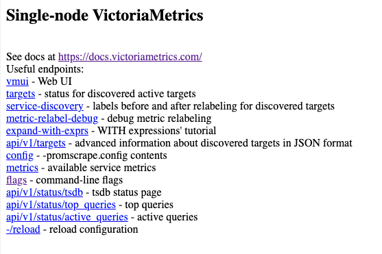

# Installation von Victoria Metrics

Es gibt hier zwei Wege: Den einfachen Weg über das Debian Package, und den manuellen Weg der Installation.

Leider habe ich mit dem Debian Package es nicht geschafft das Victoria Metrics Web UI zum laufen zu bringen, welches mir bei der Entwicklung geholfen hat. Für Euch als reine Nutzer mag dies allerdings weniger relevant sein, sofern ihr nicht selbst mehr mit der Datenbank anstellen wollt.

## Installation über Debian Package

1. Victoria Metrics mittels `apt` installatiren:
   ```bash
   sudo apt update && sudo apt install victoria-metrics
   ```
1. Data Retention Period erhöhen.
   1. Die Datei `/etc/default/victoria-metrics` editieren, zum Beispiel mit VI: 
      ```bash
      sudo vi /etc/default/victoria-metrics
      ```
   1. Zur Variable `ARGS` am Ende folgendes hinzufügen:
      ```
      -retentionPeriod=100y
      ```
      100 Jahre sollten erstmal reichen. Mehr geht in Victoria Metrics leider nicht.
1. Victoria Metric starten.
   ```
   sudo systemctl start victoria-metrics
   ```
1. In einem Browser die URL `http://<server>:8428` öffnen. `<server>` dabei durch den Host namen Eures Linux servers, auf dem Victoria Metrics läuft, ersetzen. Ihr solltet diese Seite zu Gesicht bekommen:
   
   Ein Click auf den Link 'vmui' wird vermutlich zu einem 404 Fehler führen. Dies ist genau das Fehlen des Victoria Metrics Web UI, welches ich oben erwähnt habe. Leider konnte ich nicht herausfinden, wie man dieses Problem löst. 
1. Sicherstellen, dass `vmctl` richtig installiert wurde:
   ```bash
   vmctl --version
   ```

## Manuelle Installation

1. Download der Binaries der Victoria Metrics Datenbank und der Utilities von der Victoria Metrics [Releases Seite](https://github.com/VictoriaMetrics/VictoriaMetrics/releases). Wir benötigen folgende Dateien eines Releases, der KEIN Enterprise Release ist:
   - victoria-metrics-linux-<arch>>-<version>.tar.gz
   - vmutils-darwin-<arch>-<version>.tar.gz
   
   Hier sind `<arch>` durch die Systemarchitektur und `<version>` durch die Victoria Metrics Version zu ersetzen. Wenn wir zum Beispiel für einen Raspberry PI die Version v1.136.0 installieren wollen, dann laden wir uns von dem [v1.136.0 Release](https://github.com/VictoriaMetrics/VictoriaMetrics/releases/tag/v1.136.0) die Dateien 
   - victoria-metrics-linux-arm64-v1.136.0.tar.gz
   - vmutils-darwin-arm64-v1.136.0.tar.gz

   herunter.
1. Übertragt die heruntergeladenen Archive auf den Server, zum Beispiel mittels `scp`.
1. Erstellt einen temporären Ordner `vm` an beliebiger Stelle in dem ihr die Archive ablegt.
1. Erstellt in diesem `vm` Ordner einen Unterordner `bin` und wechselt in diesen `vm/bin` Ordner.
1. Entpackt die Binaries aus den Archivedateien, die im übergelegenen `vm` Ordner liegen in den `vm/bin` Ordner:
   ```bash
   tar zxvf ../victoria-metrics-linux-*.tar.gz
   tar zxvf ../vmutils-*.tar.gz
   ```
1. Alle Binaries haben nun ein `-prod` Anhang im Namen. Diesen entfernen wir mit
   ```bash
   ls -1 *-prod | while read file; do mv -v $file `echo $file | sed 's/-prod$//'`; done
   ```
1. Mit einem `ls` überprüfen wir nun kurz, dass der vorherige Befehle erfolgreich war.
1. Wir setzen den Besitzer der Dateien auf root.
   ```bash
   sudo chown root:root *
   ```
1. Jetzt verschieben wir die Binaries nach `/usr/local/bin`.
   ```bash
   sudo mv * /usr/local/bin
   ```
1. Victoria Metrics braucht nun noch einen Benutzer unter dem der Dienst läuft, welcher sich aber nicht interaktiv einloggen darf.
   ```bash
   sudo useradd -s /usr/sbin/nologin victoriametrics
   ```
1. Für die Datenbankdateien brauchen wir noch ein Verzeichnis mit den richtigen Berechtigungen.
   ```bash
   sudo mkdir -p /var/lib/victoria-metrics 
   sudo chown -R victoriametrics:victoriametrics /var/lib/victoria-metrics
   ```
1. Jetzt müssen wir noch einen Service für die Datenbank erstellen, welcher auch gleich die richtige Data Retention Period setzt.
   ```bash
   sudo bash -c 'cat <<END >/etc/systemd/system/victoriametrics.service
   [Unit]
   Description=VictoriaMetrics service
   After=network.target

   [Service]
   Type=simple
   User=victoriametrics
   Group=victoriametrics
   ExecStart=/usr/local/bin/victoria-metrics -storageDataPath=/var/lib/victoria-metrics -retentionPeriod=100y -selfScrapeInterval=10s
   SyslogIdentifier=victoriametrics
   Restart=always

   PrivateTmp=yes
   ProtectHome=yes
   NoNewPrivileges=yes

   ProtectSystem=full

   [Install]
   WantedBy=multi-user.target
   END'
   ```
1. Dieser Dienst muss nun noch aktiviert und gestartet werden.
   ```bash
   sudo systemctl daemon-reload
   sudo systemctl enable --now victoriametrics.service
   ```
1. Mit dem folgenden Befehl überprüfen wir, dass der Dienst korrekt läuft.
   ```bash
   sudo systemctl status victoriametrics.service
   ```
1. In einem Browser die URL `http://<server>:8428` öffnen. `<server>` dabei durch den Host namen Eures Linux servers, auf dem Victoria Metrics läuft, ersetzen. Ihr solltet diese Seite zu Gesicht bekommen:
   
   Ein Click auf den Link 'vmui' sollte nun das Victoria Metrics Web UI öffnen.
1. Sicherstellen, dass `vmctl` richtig installiert wurde:
   ```bash
   vmctl --version
   ```