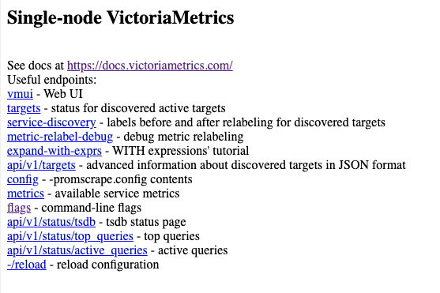

# Installation of Victoria Metrics

There are several ways to install Victoria Metrics:

- Docker image (recommended)
- Debian package (note: the Web UI may not work with this method; if you don't need it, this may be the best option)
- Installation via binaries

## Installation using Docker and Docker Compose

1. Install `docker-compose`:
   ```bash
   sudo apt update && sudo apt install docker-compose
   ```
1. Create a directory for Victoria Metrics data storage. For example, in your home directory under `docker/victoria-metrics`:
   ```bash
   mkdir -p ~/docker/victoria-metrics
   cd ~/docker/victoria-metrics
   ```
1. Create a `docker-compose.yml` file in this directory with the following content:
   ```yaml
   services:
      # VictoriaMetrics instance, a single process responsible for
      # storing metrics and serving read requests.
      victoriametrics:
         image: victoriametrics/victoria-metrics:latest
         ports:
            - 8428:8428
            - 8089:8089
            - 8089:8089/udp
            - 2003:2003
            - 2003:2003/udp
            - 4242:4242
         volumes:
            - ./vmdata:/storage
         command:
            - "--storageDataPath=/storage"
            - "--graphiteListenAddr=:2003"
            - "--opentsdbListenAddr=:4242"
            - "--httpListenAddr=:8428"
            - "--influxListenAddr=:8089"
            - "--vmalert.proxyURL=http://vmalert:8880"
            - "--retentionPeriod=100y"
         restart: always
   ```
1. Download and start the Docker container:
   ```bash
   sudo docker-compose pull && sudo docker-compose up -d
   ```
1. Open `http://<server>:8428` in your browser. Replace `<server>` with the hostname of your Linux server running Victoria Metrics. You should see the following page:

   

   Click the 'vmui' link to open the Victoria Metrics Web UI.
1. Run the CLI `vmutil` via Docker:
   ```
   sudo docker run -it --rm victoriametrics/vmctl:latest --version
   ```
   This should produce output similar to:
   ```
   Unable to find image 'victoriametrics/vmctl:latest' locally
   latest: Pulling from victoriametrics/vmctl
   d8ad8cd72600: Already exists 
   466c3c6cfeee: Already exists 
   fd4bd266edb3: Pull complete 
   Digest: sha256:a0bb731558882068bc6677c787b6376004beb359906b1bb93bdd88cadb577962
   Status: Downloaded newer image for victoriametrics/vmctl:latest
   2026/03/01 21:12:05 INFO: metrics: disable exposing PSI metrics because of failed init: open /sys/fs/cgroup/cpu.pressure: no such file or directory
   vmctl version vmctl-20260213-201617-tags-v1.136.0-0-g7386a35942
   2026/03/01 21:12:05 Total time: 675.49µs
   ```

Done.

If a newer version of Victoria Metrics is released, upgrading is very easy with Docker:
```bash
cd ~/docker/victoria-metrics
sudo docker-compose pull && sudo docker-compose up -d
```

## Installation using Debian package

1. Install Victoria Metrics using `apt`:
   ```bash
   sudo apt update && sudo apt install victoria-metrics
   ```
1. Increase the data retention period.
   1. Edit the file `/etc/default/victoria-metrics`, for example using VI:
      ```bash
      sudo vi /etc/default/victoria-metrics
      ```
   1. Add the following to the `ARGS` variable at the end:
      ```
      -retentionPeriod=100y
      ```
      100 years should be sufficient for most use cases. Victoria Metrics does not support a longer period.
1. Start Victoria Metrics.
   ```
   sudo systemctl start victoria-metrics
   ```
1. Open `http://<server>:8428` in your browser. Replace `<server>` with the hostname of your Linux server running Victoria Metrics. You should see the following page:

   

   Clicking the 'vmui' link will likely result in a 404 error. This is the missing Victoria Metrics Web UI mentioned above. Unfortunately, I could not find a solution for this issue.
1. Verify that `vmctl` is installed correctly:
   ```bash
   vmctl --version
   ```

## Installation using binaries

1. Download the Victoria Metrics database binaries and utilities from the Victoria Metrics [Releases page](https://github.com/VictoriaMetrics/VictoriaMetrics/releases). You need the following files from a release that is NOT an Enterprise release:
   - victoria-metrics-linux-<arch>-<version>.tar.gz
   - vmutils-darwin-<arch>-<version>.tar.gz
   
   Replace `<arch>` with your system architecture and `<version>` with the Victoria Metrics version. For example, to install version v1.136.0 for a Raspberry PI, download the files from the [v1.136.0 release](https://github.com/VictoriaMetrics/VictoriaMetrics/releases/tag/v1.136.0):
   - victoria-metrics-linux-arm64-v1.136.0.tar.gz
   - vmutils-darwin-arm64-v1.136.0.tar.gz

1. Transfer the downloaded archives to your server, for example using `scp`.
1. Create a temporary folder `vm` anywhere to store the archives.
1. Create a subfolder `bin` in this `vm` folder and switch to the `vm/bin` folder.
1. Extract the binaries from the archive files located in the parent `vm` folder into the `vm/bin` folder:
   ```bash
   tar zxvf ../victoria-metrics-linux-*.tar.gz
   tar zxvf ../vmutils-*.tar.gz
   ```
1. All binaries now have a `-prod` suffix in their name. Remove it with:
   ```bash
   ls -1 *-prod | while read file; do mv -v $file `echo $file | sed 's/-prod$//'`; done
   ```
1. Use `ls` to quickly check that the previous command was successful.
1. Set the owner of the files to root:
   ```bash
   sudo chown root:root *
   ```
1. Move the binaries to `/usr/local/bin`:
   ```bash
   sudo mv * /usr/local/bin
   ```
1. Victoria Metrics needs a user to run the service, who must not be able to log in interactively:
   ```bash
   sudo useradd -s /usr/sbin/nologin victoriametrics
   ```
1. For the database files, create a directory with the correct permissions:
   ```bash
   sudo mkdir -p /var/lib/victoria-metrics 
   sudo chown -R victoriametrics:victoriametrics /var/lib/victoria-metrics
   ```
1. Create a service for the database, which also sets the correct data retention period:
   ```bash
   sudo bash -c 'cat <<END >/etc/systemd/system/victoriametrics.service
   [Unit]
   Description=VictoriaMetrics service
   After=network.target

   [Service]
   Type=simple
   User=victoriametrics
   Group=victoriametrics
   ExecStart=/usr/local/bin/victoria-metrics -storageDataPath=/var/lib/victoria-metrics -retentionPeriod=100y -selfScrapeInterval=10s
   SyslogIdentifier=victoriametrics
   Restart=always

   PrivateTmp=yes
   ProtectHome=yes
   NoNewPrivileges=yes

   ProtectSystem=full

   [Install]
   WantedBy=multi-user.target
   END'
   ```
1. Enable and start the service:
   ```bash
   sudo systemctl daemon-reload
   sudo systemctl enable --now victoriametrics.service
   ```
1. Use the following command to check that the service is running correctly:
   ```bash
   sudo systemctl status victoriametrics.service
   ```
1. Open `http://<server>:8428` in your browser. Replace `<server>` with the hostname of your Linux server running Victoria Metrics. You should see the following page:
   
   Click the 'vmui' link to open the Victoria Metrics Web UI.
1. Verify that `vmctl` is installed correctly:
   ```bash
   vmctl --version
   ```

## Other installation methods

Victoria Metrics is also available via other methods such as Helm Charts or Kubernetes. See the [Quick Start](https://docs.victoriametrics.com/victoriametrics/quick-start/) guide from Victoria Metrics.

Regardless of how you install Victoria Metrics, make sure to set the parameter `-retentionPeriod=100y` when running the database.